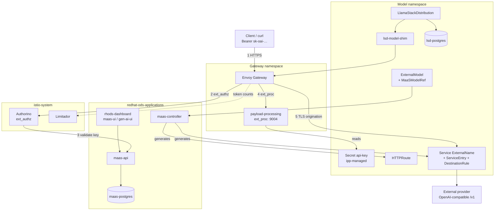
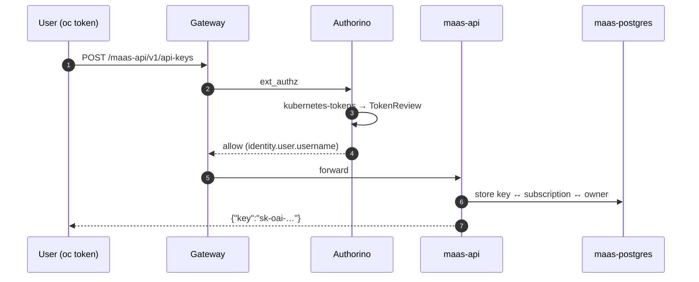
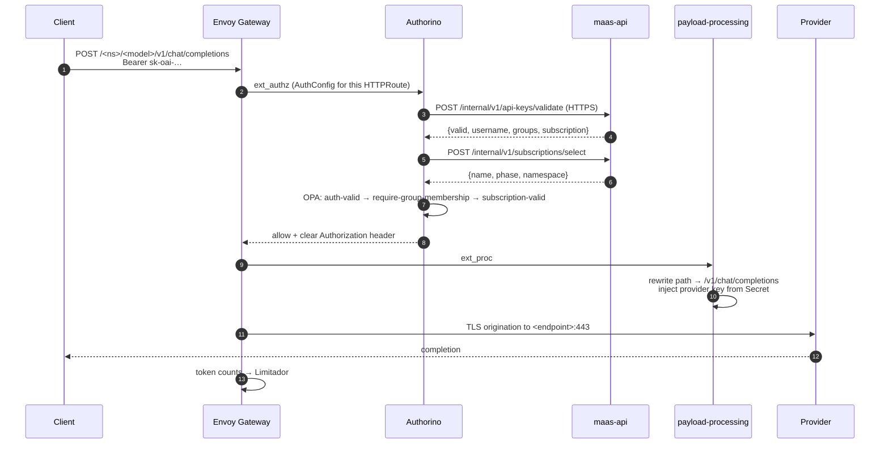
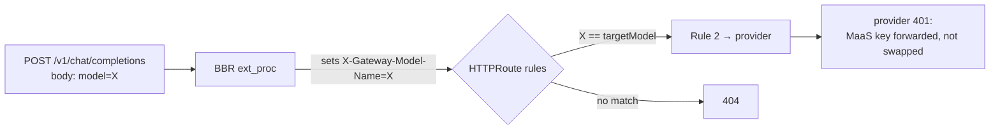
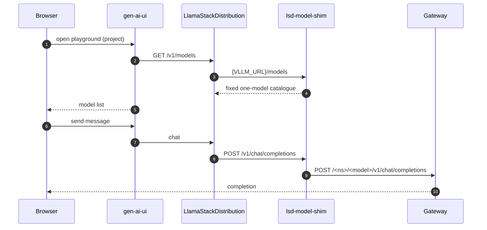
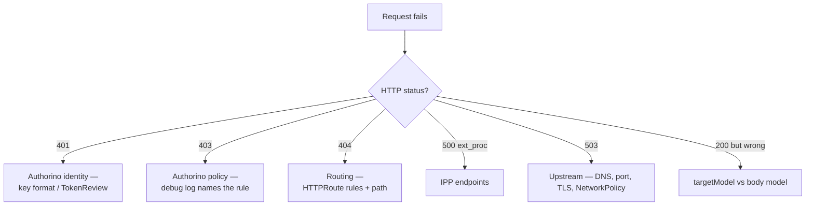

# Understanding MaaS — external models, gateway, playground

Maintenance-engineering view of **Models-as-a-Service on RHOAI 3.4.x**: the runtime
components an external model adds, the exact hop chain of a request, and the failure
signatures at each hop.

Companion: **[UNDERSTANDING_OAI.md](./UNDERSTANDING_OAI.md)** for the platform underneath.

> Hostnames here use `ai.example.com`. Substitute your own published domain.

---

## 1. What MaaS is

A gateway in front of models that adds **identity, subscriptions, token rate limits
and credential injection**. Clients get a MaaS API key (`sk-oai-…`); the real provider
credential never leaves the cluster — it is swapped in at the gateway.

An **external model** is a model MaaS does not host: it proxies to a provider you
already have. The key consequence for capacity planning:

> **An external model adds zero runtime pods.** It is Services, ServiceEntries,
> DestinationRules, HTTPRoutes and policies — routing metadata, not workload.

---

## 2. Footprint

### Platform (once per cluster)

| Deployment | Namespace | Pods | Containers | Purpose |
|---|---|---|---|---|
| `maas-api` | `redhat-ods-applications` | 1 | 1 | REST API: keys, subscriptions, catalogue. Also serves `/internal/*` for Authorino. |
| `maas-controller` | `redhat-ods-applications` | 1 | 1 | Reconciles `ExternalModel`/`MaaSModelRef` into routing + policies. |
| `maas-postgres` | `redhat-ods-applications` | 1 | 1 | MaaS database. **Not** shared with anything else. |
| `payload-processing` (IPP) | gateway NS | 1 | 1 | ext_proc on `:9004` — path rewrite + provider key injection. |
| Gateway pod | gateway NS | 1–2 | 1 | Envoy for the Gateway API `Gateway`. |
| `authorino` | `istio-system` | 1 | 1 | ext_authz — validates keys, evaluates policy. Shared with Connectivity Link. |
| `limitador` | `istio-system` | 1 | 1 | Token rate limiting. Shared. |

**≈ 6–8 pods** beyond the RHOAI baseline, mostly shared across all models.

### Per external model

| Object | Kind | Pods |
|---|---|---|
| `<model>` | `ExternalModel` | 0 |
| `<model>` | `MaaSModelRef` | 0 |
| `<model>-provider` | `Secret` (`api-key`) | 0 |
| `<model>` | `Service` (ExternalName) | 0 |
| `<model>` | `ServiceEntry` + `DestinationRule` | 0 |
| `<model>` | `HTTPRoute` (2 rules) | 0 |
| `maas-auth-<model>` | `AuthPolicy` → `AuthConfig` | 0 |
| `maas-trlp-<model>` | `TokenRateLimitPolicy` | 0 |
| `<model>-access` | `MaaSAuthPolicy` + `MaaSSubscription` | 0 |

**Total: 0 pods, 0 containers.** Ten objects, no workload.

### Per playground project

| Deployment | Pods | Containers | Purpose |
|---|---|---|---|
| `lsd-genai-playground` | 1 | 1 | LlamaStackDistribution — the playground backend. |
| `lsd-postgres` | 1 | 1 | Its metadata/inference store. The RH distribution image has **no sqlite fallback**. |
| `lsd-model-shim` | 1 | 1 | Serves `/v1/models` for discovery; forwards the rest. See §7. |

**3 pods / 3 containers per project** that uses the playground.

```bash
oc get deploy -n <model-ns> -o custom-columns='NAME:.metadata.name,READY:.status.readyReplicas,CONTAINERS:.spec.template.spec.containers[*].name'
```

---

## 3. Component view



---

## 4. Request flow — minting a key



The key is bound to a **subscription**, and the subscription's `spec.owner` decides
who may use it later.

---

## 5. Request flow — chat completion (the working path)



Three things that trip people up:

- **Authorino clears the `Authorization` header** and IPP puts the *provider* key
  back. If IPP does not run, the provider receives the caller's MaaS key and rejects it.
- **`ExternalModel.spec.endpoint` is a hostname only** — no scheme, no port, no path.
  The controller always originates TLS to **443**.
- The provider must be reachable **from the cluster** and present a certificate the
  mesh trusts.

---

## 6. Two routes, one model

The controller generates an `HTTPRoute` with two rules:

| Rule | Match | Works? |
|---|---|---|
| 1 | `PathPrefix: /<ns>/<model>` | ✅ full path — auth + IPP injection |
| 2 | `PathPrefix: /` + header `X-Gateway-Model-Name: <targetModel>` | ⚠️ routes, but **no credential injection** |

Rule 2 exists for the canonical OpenAI shape (`POST /v1/chat/completions`, model in
the body). Body-Based Routing reads `"model"` and sets the header.



Two defects live here, and together they make the canonical root path unusable:

1. `GET /v1/models` advertises the **ExternalModel name**, while rule 2 matches on
   **`targetModel`**. They only agree if the object is named after its target model.
2. IPP does not inject the provider credential on the header-matched route.

**Use the per-model path.** Everything in this repo does.

---

## 7. Playground (Gen AI studio)



Why the shim exists: LlamaStack's `remote::vllm` provider registers models by calling
`{VLLM_URL}/models`. MaaS returns **404** for that under the per-model prefix and only
serves the catalogue at the gateway root — where chat does not work (§6). The image
has no registration API (`/v1/models` is GET-only) and no static `models:` section, so
discovery is the only mechanism. The shim answers discovery and forwards everything
else to the path that works.

Manifests: [playground/](playground/) — `llamastackdistribution.yaml`, `postgres.yaml`,
`model-shim.yaml`. Applied by `scripts/15-playground.sh`.

---

## 8. Failure catalogue

Each row is a real signature. **Every one of these is invisible to the caller** —
the client sees a bare 403/503 and the reason exists only in a server-side log.

| Symptom | Layer | Cause | Fix |
|---|---|---|---|
| `MaaSModelRef` `Failed`: *does not reference gateway `<ns>/maas-default-gateway`* | controller | Gateway is not where `--gateway-namespace` points | `oc set env deploy/maas-controller --list \| grep -i gateway`; move the Gateway (`scripts/06-gateway-rename.sh`) |
| 403, `x-ext-auth-reason: Unauthorized`, empty body | Authorino | An OPA rule denied. Enable `logLevel: debug` on the `Authorino` CR to see which | `oc logs -n istio-system deploy/authorino` |
| Authorino: `cannot fetch metadata … x509: certificate signed by unknown authority` | Authorino → maas-api | Authorino does not trust the service-serving CA | Add the service CA to the cluster trusted bundle (`proxy/cluster` `trustedCA`) |
| `subscription-valid` denied, `subscription-info` empty | Authorino | `apiKeyValidation` failed upstream — look one hop earlier | Fix the metadata fetch first |
| 403 on `/maas-api/v1/api-keys/search` from the dashboard only | RBAC | Dashboard SA has no MaaS role; `maas-viewer-role`/`maas-owner-role` ship **unbound** | [cluster/40-dashboard-maas-rbac.yaml](cluster/40-dashboard-maas-rbac.yaml) |
| 500 `ext_proc_error … no_healthy_upstream` | IPP | ext_proc points at a `payload-processing` Service with no endpoints | Point `IPP_NS` at where IPP actually runs |
| 503 `upstream_reset … connection_timeout` | egress | Provider port is not 443, or NetworkPolicy drops it | `endpoint` cannot carry a port — expose the provider on 443 |
| 503 `CERTIFICATE_VERIFY_FAILED` | TLS origination | Envoy does not trust the provider certificate | Trust the CA cluster-wide, or use a publicly-trusted endpoint |
| Provider returns 401 with your MaaS key | IPP | Credential not injected (header-matched route, §6) | Use the per-model path |
| `no LlamaStackDistribution found in namespace` | dashboard | No LSD in the project | `scripts/15-playground.sh` |
| LSD `Distribution name not supported` | LSD operator | `spec.server.distribution.name` not in the operator's table | Pin `image:` from `RELATED_IMAGE_*_DISTRIBUTION` |
| LSD crashloop `Could not connect to PostgreSQL` | LSD | RH distribution requires Postgres; no sqlite fallback | [playground/postgres.yaml](playground/postgres.yaml) |
| Playground lists no models | LSD | Discovery 404s under the per-model prefix | [playground/model-shim.yaml](playground/model-shim.yaml) |
| Playground: *model unavailable* | dashboard | `gen-ai-ui` counts `externalModels=0` despite the CR existing | Open, see §10 |

---

## 9. Diagnostic order

Work outside-in. Each step isolates one hop.



```bash
oc get maasmodelrefs.maas.opendatahub.io -A -o custom-columns='NS:.metadata.namespace,NAME:.metadata.name,PHASE:.status.phase,MSG:.status.conditions[0].message'
```

```bash
oc get httproutes.gateway.networking.k8s.io -A -o custom-columns='NS:.metadata.namespace,NAME:.metadata.name,PARENT:.spec.parentRefs[*].name,ACCEPTED:.status.parents[*].conditions[?(@.type=="Accepted")].status'
```

```bash
oc get authconfigs.authorino.kuadrant.io -A
```

The `AuthConfig` for a route is named by a hash. Find the right one from the request:
Authorino's debug log prints `context_extensions.host` — that value **is** the
AuthConfig name.

---

## 10. Known product gaps

Reproduced on RHOAI 3.4.2, each with evidence. Useful when opening a support case.

1. `maas-viewer-role` / `maas-owner-role` ship with **no ClusterRoleBinding**, so the
   dashboard ServiceAccount gets 403 from `maas-api`.
2. Authorino's generated `AuthConfig` calls `maas-api` over HTTPS with no way to trust
   the service-serving CA; the only fix is a **cluster-wide** `proxy/cluster` change.
3. `--gateway-name` / `--gateway-namespace` come from an operator-owned ConfigMap with
   **no DSC field** to set them — the Gateway must move to the controller.
4. The LlamaStack distribution needs a Postgres **nobody deploys**, and its supported
   distribution name is not derivable from the operator's own `RELATED_IMAGE_*` var.
5. `/v1/models` advertises the ExternalModel name while BBR routes on `targetModel`,
   so the canonical OpenAI root path 404s.
6. IPP does not inject the provider credential on the BBR route, so that path cannot
   work even when it routes.

Common thread: **every failure surfaces only in a server-side log**, never to the
caller. Budget for log access when planning a MaaS rollout.
