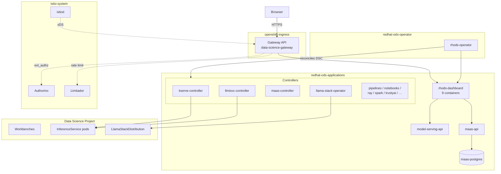
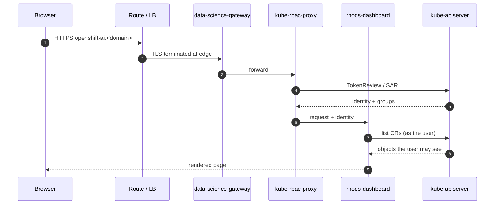
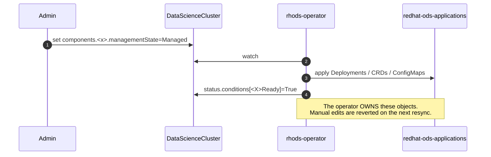

# Understanding OpenShift AI — components, communications, troubleshooting

Maintenance-engineering view of a **RHOAI 3.4.x self-managed** install: what runs,
what talks to what, and where to look when it breaks.

Companion: **[UNDERSTANDING_MAAS.md](./UNDERSTANDING_MAAS.md)** for Models-as-a-Service,
external models and the Gen AI playground.

> Counts below are **observed on a reference cluster** with most DSC components
> `Managed`. Yours will differ with the component set — every table includes the
> command to count it on your own cluster.

---

## 1. Namespaces

| Namespace | Holds | Notes |
|---|---|---|
| `redhat-ods-operator` | `rhods-operator` | Owns the DSC/DSCI; reconciles everything below. Edits to its operands revert. |
| `redhat-ods-applications` | All RHOAI operands and the dashboard | The namespace you will spend the most time in. |
| `openshift-ingress` | `data-science-gateway` (Gateway API) | Platform gateway. RHOAI puts its gateway here, not in a product namespace. |
| `istio-system` | Istiod, Authorino, Limitador | Service mesh + Connectivity Link data plane. |
| `rhoai-model-registries` | Model registry instances | Only when `modelregistry` is `Managed`. |
| *(per project)* | Workbenches, LSDs, model CRs | Namespaces labelled `opendatahub.io/dashboard=true`. |

```bash
oc get ns -l opendatahub.io/dashboard=true
```

---

## 2. Footprint

Observed on the reference cluster, `redhat-ods-applications` only:

| Metric | Count |
|---|---|
| Deployments | 23 |
| Pods | 25 |
| Containers | 41 |

The gap between pods and containers is almost entirely the dashboard: **2 replicas × 9
containers**. Everything else is a single-container controller.

Count it yourself:

```bash
oc get pods -n redhat-ods-applications --no-headers | wc -l
```

```bash
oc get pods -n redhat-ods-applications -o jsonpath='{range .items[*]}{range .spec.containers[*]}{.name}{"\n"}{end}{end}' | wc -l
```

Add roughly: 1 pod (operator), 1–2 (platform gateway in `openshift-ingress`), and
3–6 in `istio-system` (istiod, Authorino, Limitador) — so a full install lands
around **30–35 pods / 45–55 containers** before any user workload.

---

## 3. Deployments

All in `redhat-ods-applications` unless stated. `role` tells you what to expect in
the logs: a **controller** reconciles CRs, a **service** answers requests.

| Deployment | Role | What it does | Find it |
|---|---|---|---|
| `rhods-operator` *(redhat-ods-operator)* | operator | Reconciles DSC/DSCI into every operand below. Reverts manual edits. | `oc get deploy -n redhat-ods-operator` |
| `rhods-dashboard` | **frontend** | The web console. 9 containers — see §4. | `oc logs deploy/rhods-dashboard -c <container>` |
| `dashboard-redirect` | frontend | nginx redirect to the dashboard host. | 2 replicas, nginx only |
| `model-serving-api` | service | Backend API for model serving views. | `-c server` |
| `kserve-controller-manager` | controller | Reconciles `InferenceService`. | `oc get inferenceservice -A` |
| `llmisvc-controller-manager` | controller | Reconciles `LLMInferenceService` (LLM-specific serving). | `oc get llminferenceservice -A` |
| `odh-model-controller` | controller | Wires serving into routes, auth, monitoring. | Look here when serving works but is not reachable |
| `maas-controller` | controller | Models-as-a-Service — see UNDERSTANDING_MAAS.md | `oc get externalmodels -A` |
| `maas-api` | **service** | MaaS REST API: API keys, subscriptions, model catalogue. | `oc logs deploy/maas-api` |
| `maas-postgres` | datastore | MaaS database (API keys, subscriptions). | Not for reuse by other components |
| `llama-stack-k8s-operator-controller-manager` | controller | Reconciles `LlamaStackDistribution` (Gen AI playground backend). | `oc get llamastackdistributions -A` |
| `model-registry-operator-controller-manager` | controller | Reconciles `ModelRegistry` instances. | Instances land in `rhoai-model-registries` |
| `data-science-pipelines-operator-controller-manager` | controller | Reconciles `DataSciencePipelinesApplication`. | Per-project pipeline servers |
| `notebook-controller-deployment` | controller | Reconciles `Notebook` CRs (workbench lifecycle). | Pairs with the next row |
| `odh-notebook-controller-manager` | controller | Injects auth proxy / networking into notebooks. | Workbench 403s start here |
| `kubeflow-trainer-controller-manager` | controller | Training jobs (Trainer v2). | |
| `kubeflow-training-operator` | controller | Training jobs (legacy). | |
| `kuberay-operator` | controller | Ray clusters for distributed workloads. | |
| `spark-operator-controller` + `spark-operator-webhook` | controller | Spark jobs; webhook mutates pods. | Webhook failures block pod creation |
| `trustyai-service-operator-controller-manager` | controller | Bias/drift, guardrails, LM-Eval. | |
| `feast-operator-controller-manager` | controller | Feature store. | |
| `mlflow-operator-controller-manager` | controller | MLflow tracking servers. | |
| `workload-variant-autoscaler-controller-manager` | controller | Scales serving variants. | |

```bash
oc get deploy -n redhat-ods-applications -o custom-columns='NAME:.metadata.name,READY:.status.readyReplicas,CONTAINERS:.spec.template.spec.containers[*].name'
```

---

## 4. The dashboard is nine containers

One pod serves every UI. **Picking the wrong container is the most common
time-waster when reading dashboard logs** — each feature logs only in its own.

| Container | Serves | Grep it when |
|---|---|---|
| `rhods-dashboard` | Core UI + BFF | Projects, workbenches, general 500s |
| `kube-rbac-proxy` | AuthN/AuthZ in front of the UI | 401/403 before any UI renders |
| `gen-ai-ui` | Gen AI studio, playground, AI asset endpoints | Playground blank / "model unavailable" |
| `maas-ui` | MaaS pages, API keys | MaaS views empty, key mint failures |
| `model-registry-ui` | Model registry views | |
| `mlflow-ui` | MLflow views | |
| `eval-hub-ui` | Evaluation hub | |
| `automl-ui` | AutoML | |
| `autorag-ui` | AutoRAG | |

```bash
oc get deploy rhods-dashboard -n redhat-ods-applications -o jsonpath='{range .spec.template.spec.containers[*]}{.name}{"\n"}{end}'
```

```bash
oc logs -n redhat-ods-applications deploy/rhods-dashboard -c gen-ai-ui --tail=100
```

---

## 5. Component view



---

## 6. Request flow — opening the dashboard



Two consequences worth remembering:

- The dashboard lists objects **as the logged-in user**, so an empty page is often
  RBAC, not a missing object. Check with `oc auth can-i … --as=<user>`.
- Some backends (notably `gen-ai-ui` → `maas-api`) call **as the dashboard
  ServiceAccount**, not the user. Those need their own RoleBindings, and a 403
  there is invisible in the browser.

---

## 7. Control-plane flow — enabling a component



**This is the single most important operational fact in RHOAI.** If you patch an
operand — a ConfigMap, a Deployment env var, a generated policy — it works until the
next reconcile and then silently reverts. Change it at the DSC, or accept it is not
configurable.

```bash
oc get datasciencecluster -o jsonpath='{range .items[0].status.conditions[*]}{.type}={.status} {.reason}{"\n"}{end}'
```

---

## 8. Troubleshooting map

| Symptom | Look at | Command |
|---|---|---|
| Component missing entirely | DSC managementState + conditions | `oc get datasciencecluster -o yaml` |
| Component `Ready=False` | Operator log | `oc logs -n redhat-ods-operator deploy/rhods-operator --tail=200` |
| Dashboard page blank/500 | The **right** dashboard container (§4) | `oc logs deploy/rhods-dashboard -c <ui>` |
| Dashboard shows nothing but objects exist | RBAC — user vs ServiceAccount | `oc auth can-i list <res> -n <ns> --as=<subject>` |
| Project missing from dashboard | Namespace label | `oc get ns <ns> --show-labels` → needs `opendatahub.io/dashboard=true` |
| Serving deployed but unreachable | Gateway + `odh-model-controller` | `oc get gateways.gateway.networking.k8s.io -A` |
| 401/403 at the edge | Authorino | `oc logs -n istio-system deploy/authorino` |
| Your change keeps reverting | It is operator-owned (§7) | `oc get <obj> -o jsonpath='{.metadata.ownerReferences}'` |

Ambiguous kind names bite here. `oc get gateway` may resolve to Istio's `Gateway`
rather than Gateway API's, and `oc get tenant` to 3scale's rather than MaaS's.
**Always fully qualify** when a result looks wrong:

```bash
oc get gateways.gateway.networking.k8s.io -A
```

```bash
oc api-resources | awk '$NF=="Gateway" || $NF=="Tenant"'
```

---

## 9. First command on an unknown cluster

`scripts/00-discover.sh` collects a redacted evidence bundle and prints PASS/WARN/FAIL
per check with a fix for each. It assumes no `config.env` and no prior install.

```bash
./scripts/00-discover.sh
```
